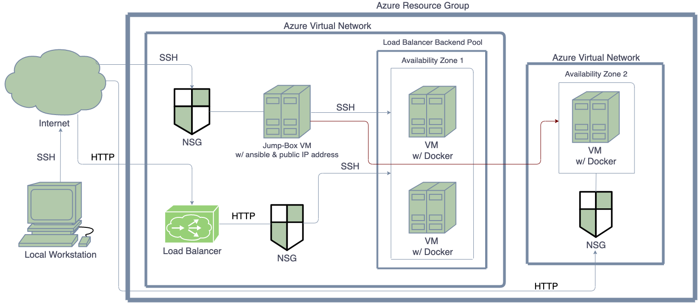
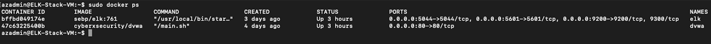

## Automated ELK Stack Deployment

The files in this repository were used to configure the network depicted below.

These files have been tested and used to generate a live ELK deployment on Azure. They can be used to either recreate the entire deployment pictured above. Alternatively, select portions of the install-elk.yml file may be used to install only certain pieces of it, such as Filebeat.

This document contains the following details:
- Description of the Topology
- Access Policies
- ELK Configuration
  - Beats in Use
  - Metrics in Use
  - Machines Being Monitored
- How to Use the Ansible Build

### Description of the Topology

The main purpose of this network is to expose a load-balanced and monitored instance of DVWA, the D*mn Vulnerable Web Application.

Load balancing ensures that the application will be highly available, in addition to restricting traffic to the network.

Integrating an ELK server allows users to easily monitor the vulnerable VMs for changes to the files and system metrics.

The configuration details of each machine may be found below.

| Name     | Function | IP Address | Operating System |
|----------|----------|------------|------------------|
| Jump Box | Gateway  | 10.0.0.4   | Linux            |
| Jump Box | Gateway  | Public IP 138.91.234.112 | Linux        |
| Web-1    | DVWA 1   | 10.0.0.7   | Linux            |
| Web-2    | DVWA 2   | 10.0.0.8   | Linux            |
| ELK      | Security | 10.1.0.5   | Linux            |

### Access Policies

The machines on the internal network are not exposed to the public Internet. 

Only the Jump-Box-Provisioner machine can accept connections from the Internet. Access to this machine is only allowed from the following IP addresses: 72.195.237.4

Machines within the network can only be accessed by the Jump-Box-Provisioner machine with Ansible container. IP address: 138.91.234.112

Commands: 
  ssh azadmin@138.91.234.112
  sudo docker start frosty_kilby
  sudo docker attach frosty_kilby

A summary of the access policies in place can be found in the table below.

| Name     | Publicly Accessible | Allowed IP Addresses |
|----------|---------------------|----------------------|
| Jump Box | Yes                 | workstation public IP|
| Web-1    | No                  | 10.0.0.4 10.0.0.8    |
| Web-2    | No                  | 10.0.0.4 10.0.0.7    |
| Load Balancer | No             | workstation public IP|
|ELK Server| No                  | 138.91.234.112       |
|ELK Server [Kibana]| Yes        | workstation public IP|
### Elk Configuration

Ansible was used to automate configuration of the ELK machine. No configuration was performed manually, which is advantageous because it ensures that our provisioning scripts run identically everywhere we use them. This further ensures our configurations will do exactly the same thing every time we run them, by eliminating as much variability between configurations as possible.

The playbook implements the following tasks:
- Install docker.io
- Install python3-pip3
- Install Docker module
- Increase virtual memory
- Use more memory
- Download and launch a docker elk container

The following screenshot displays the result of running `docker ps` after successfully configuring the ELK instance.

### Target Machines & Beats
This ELK server is configured to monitor the following machines:
- 10.0.0.7
- 10.0.0.8

We have installed the following Beats on these machines:
- Filebeat
- Metricbeat

These Beats allow us to collect the following information from each machine:

- Filebeat is the logging agent installed on the machine generating log files, tailing them, and forwarding the data to Logstash for advanced processing or Elasticsearch for indexing. We can view these logs in Kibana. For example, Filebeat allows us to view how many times we used SSH to connect to a VM. We will be able to see the time and hostname of the source.

- Metricbeat collects metrics from the operating system and services running on the server. It takes the metrics and statistics that it collects and ships them to Elasticsearch and Logstash. For example, using Metricbeat, we can see memory usage, inbound and outbound traffic speeds etc. 

### Using the Playbook
In order to use the playbook, you will need to have an Ansible control node already configured. Assuming you have such a control node provisioned: 

SSH into the control node and follow the steps below:
- Copy the install-elk.yml file to path /etc/ansible inside the Ansible container.
- Update the hosts file to include the IP of the elk server. 
- Run the playbook, and navigate to https://23.96.99.53:5601/app/kibana to check that the installation worked as expected.